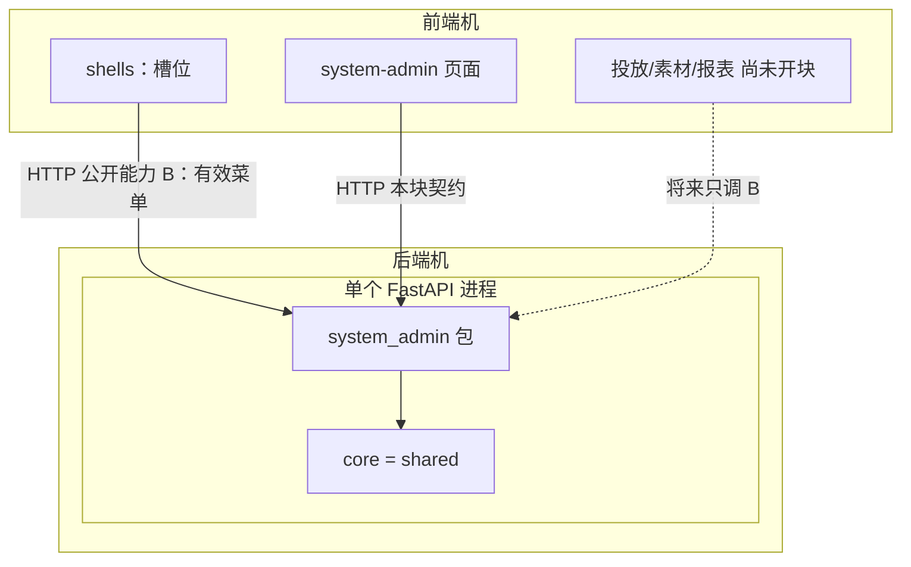

# 架构总览

状态：accepted  
融合说明：[融合.md](融合.md)。分机：[前后端分机.md](前后端分机.md)。

```mermaid
flowchart TB
  subgraph machineFe [前端机]
    Shell[shells：槽位]
    SAf[system-admin 页面]
    Later[投放/素材/报表 尚未开块]
  end

  subgraph machineBe [后端机]
    subgraph api [单个 FastAPI 进程]
      Core[core = shared]
      SA[system_admin 包]
    end
  end

  Shell -->|HTTP 公开能力 B：有效菜单| SA
  SAf -->|HTTP 本块契约| SA
  Later -.->|将来只调 B| SA
  SA --> Core
```

第一块业务已登记。不要把权限树里出现过的「智能投放」当成已经存在的包。  
前后端两台机器，只走 HTTP。细则：[前后端分机.md](前后端分机.md)（ADR 0012）。
