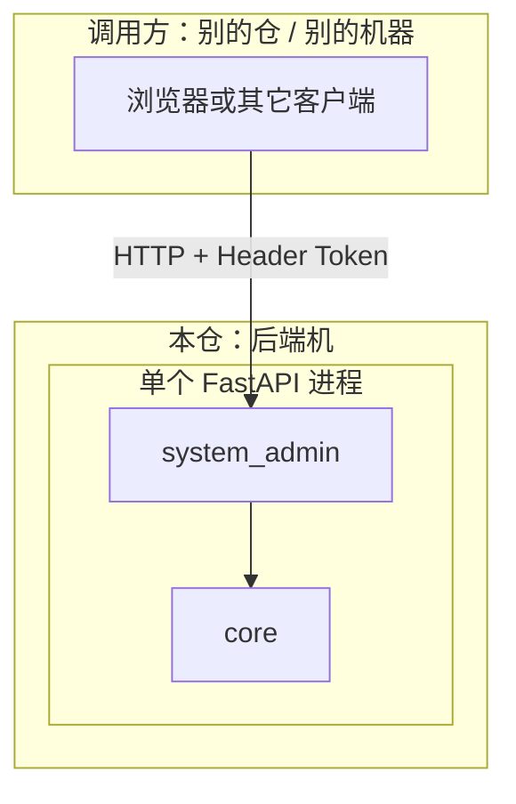

# 架构总览

状态：accepted  
融合：[融合.md](融合.md)。本进程：[前后端分机.md](前后端分机.md)。

```mermaid
flowchart TB
  subgraph callers [调用方：别的仓 / 别的机器]
    Client[浏览器或其它客户端]
  end

  subgraph machineBe [本仓：后端机]
    subgraph api [单个 FastAPI 进程]
      Core[core]
      SA[system_admin]
    end
  end

  Client -->|HTTP + Header Token| SA
  SA --> Core
```

第一块业务已登记。不要把权限树里的「智能投放」当成已经存在的包。  
本进程只提供 API；CORS 与 OpenAPI 见 [前后端分机.md](前后端分机.md)。
