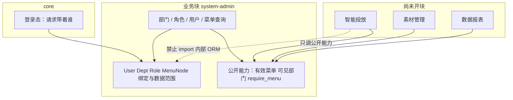

# 模块化 × 系统管理（融合）

状态：accepted  
范围：把通用切块约定落到 `system-admin`。本文件不填接口字段。

通用规则仍在 [模块化.md](模块化.md)、[共享白名单.md](共享白名单.md)、[分工.md](分工.md)、[前后端分机.md](前后端分机.md)。本文件说明：**第一块业务怎么套进去，以及以后第二块业务从哪接。**

## 一张图



## 切块怎么落到这块业务

| 约定 | 落到 system-admin |
| --- | --- |
| 一个业务一块 | 系统管理 = 一个 FastAPI 包 `system_admin` |
| 不要拆成三个业务包 | 部门 / 用户 / 角色互相引用。并行靠**包内 router 文件** |
| 认领到接口 | 见下方清单；契约由领接口的人先写 |
| shared 极瘦 | 只带「谁已登录」。角色、菜单树、数据范围、管理台全在本块 |
| 权限归业务 | **权限台是本块的产品**，不是 shared，也不是每个未来业务各建一套后台 |

原先模板里「每个业务自己管权限」，在截图到来后收成：

- **授权机器**（怎么管用户/角色/树/数据范围）→ `system-admin`
- **树上有哪些节点** → **后定**。参考导出里的投放/报表名称只证明「树可以挂这些产品区」，不证明我们现在就要做那些页
- 其它业务 **不自建** 角色管理 / 分配菜单；有页面时把节点登记进树

## 包内怎么给人领（第 3 层）

实现期目录：

```
app/modules/system_admin/
  api/
    departments.py
    department_roles.py
    department_tags.py
    roles.py
    role_menus.py
    menu_nodes.py
    users.py
    user_roles.py
    user_data_scope.py
    password_reset.py
    session_queries.py
  domain/
  schemas/
```

同一包、不同文件 = 不同的人。不要按「你写所有 schema、我写所有 service」切。

## 两类接口

### A. 系统管理 CRUD

部门树、角色、用户、各种「分配*」。给调用方 HTTP 消费。

### B. 给全中台用的公开能力（窄口）

未来投放/素材/报表 **只允许** 依赖这一层，允许 `import` 这一窄口（Depends / 公开函数），禁止碰 ORM：

| 能力 | 谁用 | 干什么 |
| --- | --- | --- |
| 当前主体对应的 User | 壳、各业务 | 知道登录的是哪条用户 |
| 有效菜单/组件集合 | 壳、各业务接口 | 功能权限 |
| 可见部门 id 列表 | 各业务列表查询 | 数据权限过滤 |
| `require_menu(...)` | 各业务接口 | 功能权限强制点 |

菜单内容不在 `core` 写死，问本块 B。

B 的契约同样要写；没契约则其它业务不得先开工去「猜」有效权限长什么样。契约会改：消费方看 `contracts/最新表.md` 与当前正文，不要缓存一份私有字段表。

## 第二块业务到来时

例如以后有 `ad-delivery`（智能投放）：

1. 复制 `_template/` → `modules/ad-delivery/`，写领域模型，**不要**再写一套角色表。
2. 若需要新入口：在 **system-admin 的菜单树**里增加节点（本块数据）。
3. 投放接口：先 `require_menu`，查数时用可见部门过滤（若按部门隔离）。
4. 不要调部门/角色 CRUD 来「自己算权限」。

菜单树里参考导出出现的「智能投放 / 素材管理 / 数据报表」只说明那套产品当时有这些入口，**不是我们现在的信息架构，也不表示那些业务块已存在。** 我们自己的节点以后登记。

## 和代码的边界

本文件只约定切块怎么落到 system-admin。实现真源是 `backend/app/`。不要按截图画 UI，不要为菜单种子里的投放页预建 CRUD。
