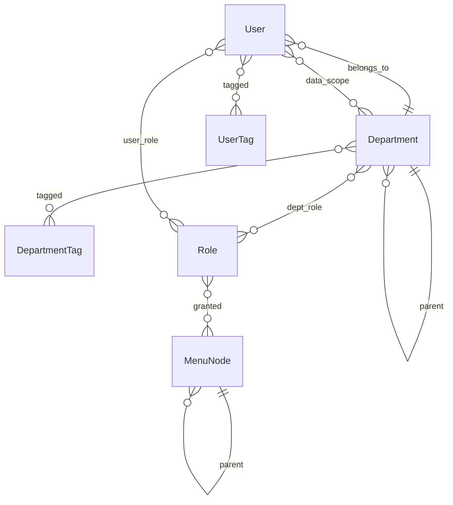

# 数据模型：system-admin

状态：review  
来源：`管理中台截图` 5.1–5.4（子 Agent 读图 + 权限角色查询表）。  
【可见】来自画面或 xlsx 原文；【推断】单独标明，未证实的不写进必填约束。

本文件锁的是**对象和关系**，不是表单布局、不是 ORM、不是接口字段表。

## 总图

没有单独的「组织」实体：侧栏「组织管理」只是分组。用户、部门有**租户对应字段**（ADR 0016）；右上角公司名、菜单「归属租户类型」用这些字段。

## 1. 部门 Department

人在哪、树怎么长、部门能挂哪些角色。

| 字段 | 必填 | 可见规则 |
| --- | --- | --- |
| id | 系统生成 | 长数字，列表可查，创建/编辑窗没有 |
| name | 是 | 树节点名 |
| parent_id | 否 | 空 = 根；编辑可改 |
| sort | 是 | 兄弟间可重复，不是全局唯一 |
| status | 是 | 列表开关；筛选项文案「使用中/已停用」，列上文案「启用」——同一布尔 |
| created_at | 系统生成 | 列表展示 |
| tenant | 是 | 所在租户（ADR 0016） |

**树【可见】** 可多级。投放部 → 投放一部/二部；技术部 → 组。

**不在创建/编辑小窗里的：** 状态（行内开关）、标签、角色（分配弹窗）。

【推断】改 parent 不能成环；有子节点时删除策略未见。

## 2. 部门标签 DepartmentTag

【可见】列表芯片（如「投放部」「投放组」），可去掉；工具条「新增部门标签」（需先勾选【推断】）。

【可见】标签 ≠ 父部门（技术部可打「投放部」标签）。

| 字段 | 说明 |
| --- | --- |
| 标签名 | 【可见】展示名 |
| 部门 n:n 标签 | 【推断】可复用 |

标签是否有独立目录 ID：【未见】。

## 3. 角色 Role

功能权限的容器。主数据只有名称和备注；菜单、用户、部门都是关系。

| 字段 | 必填 | 可见规则 |
| --- | --- | --- |
| id | 系统生成 | 列表「角色id」 |
| name | 是 | 可改 |
| remark | 否 | 最多 200 字 |
| status | 是 | 列表开关；新增/编辑窗没有此字段 |
| created_at / updated_at | 系统 | 列表 |

列表上的「已分配用户」「已分配部门」是关系的展示，不是角色表字段。

截图中的 6 个角色实例（目录样本，不是枚举约束）：组长角色、用户管理、机器人建推广链、剪辑师、运营管理员、短剧投手。

注意：有一个**角色名叫「用户管理」**，和菜单「用户管理」同名——仍是 Role 实例。

## 4. 用户 User

账号主档。一人 **一个** 所属部门。

| 字段 | 必填 | 可见规则 |
| --- | --- | --- |
| id | 系统生成 | 可筛 |
| nickname | 是 | 用户昵称，可改 |
| login_account | 是 | 用户名或手机号；创建后不可改 |
| short_name | 否 | 用户简称 |
| password | 条件 | 新增可空 → 默认密码；重置见下 |
| phone | 否 | 样本可为 `-` |
| status | 是 | 同部门：筛「使用中/已停用」，列「启用」 |
| department_id | 是 | 组织树**单选** |
| role_kind | 修改页必填 | **负责人 \| 成员**。这是用户在所属部门上的岗位类型，**不是** Role 实体 |
| remark | 否 | 最多 200 |
| created_at | 系统 | |
| tenant | 是 | 所在租户；右上角公司名用此（ADR 0016） |

【推断】新增后默认启用、role_kind 默认「成员」（新增窗无此字段）。

未见：邮箱、性别、工号、有效期。

**默认/重置密码**：规则存在库里的**字典配置**（ADR 0016），不写死后缀 `135`。新增空密码则套该配置。

## 5. 用户标签 UserTag

【可见】列表「标签」列（素材手、投手）；「新增用户标签」。

与部门节点名可同名（「一部A组素材手」是部门，「素材手」是用户标签）——**不要建成同一个实体**。

一人多标签：样本每人一个，【推断】可能多值，未证实。

## 6. 菜单节点 MenuNode

功能权限的对象。xlsx 无权限码列。树上有哪些节点见 [权限清单-参考.md](权限清单-参考.md)（ADR 0016）。

| 字段 | 说明 |
| --- | --- |
| id | 实现期代理主键 |
| name | 展示名；同名可在不同父下出现 |
| type | 目录 / 菜单 / 组件 |
| parent_id | 树；目录通常不挂角色 |
| business_domain | 分类，取值按清单表 |
| tenant_kind | 分类，取值按清单表 |

用户、部门另有租户字段（展示公司名 / 归属租户）。

另有 **字典配置**（默认密码等），不是业务权限树。

## 7. 关系（带属性的都单独成表）

### 7.1 部门 ↔ 角色 DepartmentRole

【可见】部门行「分配角色」：角色列表 + 对该部门「未分配/已分配」+ 分配时间。栏名叫「权限状态」，语义是**是否已挂到该部门**，不是角色启停。

| 属性 | 说明 |
| --- | --- |
| department_id, role_id | |
| assigned_at | 未分配时为 `-` |

基数 n:n。用户侧可多挂角色（ADR 0016）。

### 7.2 用户 ↔ 角色 UserRole（用户角色）

【可见】用户行「分配角色」：与部门分配同一套角色目录、同样的未分配/已分配 + 分配时间。

【可见】列表把角色拆成两行：**用户角色** / **部门角色**。样本里用户角色可空，部门角色仍可有值；此时分配弹窗里同名角色仍是「未分配」→ **用户角色 ≠ 部门角色**，部门角色来自部门上的分配（【推断】只读继承，不是这个弹窗写的）。

### 7.3 用户 ↔ 部门（数据范围）UserDataScope

【可见】「分配部门数据权限」：组织树**复选**，自定义部门集合。列表「数据权限」顿号拼接部门名，可为空 `-`。

【可见】与所属部门独立：

- 有所属部门、数据权限为 `-`（乔永志）
- 数据权限可含非所属部门，也可显式含所属部门

无「全部 / 本部门 / 本部门及以下 / 仅本人」档位。不要建模成若依 `dataScope=1..5`，除非以后出现那种界面。

勾父 = 选中全部子孙，可再取消个别子孙。空集合 = 无数据权限（ADR 0016）。

### 7.4 角色 ↔ 菜单 RoleMenu

【可见】角色行按钮「分配权限」，弹窗标题「分配菜单」：按业务领域滤树，勾选目录/菜单/组件。

【可见】反查页「权限角色查询」：节点 → 已分配角色（多个顿号）。**不是第二种实体。** 文件名「权限角色管理」以页标题为准：查询。

【可见】组件可与父菜单角色不一致（每日利润统计：投手+运营；其下编辑列/参数配置/盈亏运行：仅运营）。

目录节点在查询表上已分配角色为 `-`；勾父目录是否等于勾全部子孙：【未证实】。

## 明确不是实体

| 名称 | 实际是 |
| --- | --- |
| 组织 | 菜单分组 |
| 权限角色 | 角色–菜单的反查视图 |
| 权限码 | 本批材料没有 |
| 角色类型（负责人/成员） | User.role_kind，不是 Role |
| 权限状态（分配弹窗） | 关系上的已分配/未分配 |
